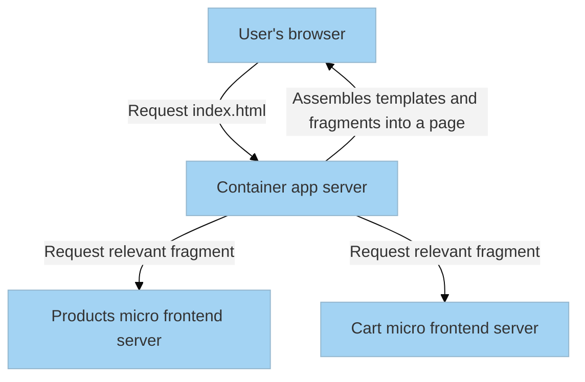

# Welcome to this micro-frontend workshop!

This is the first example for this workshop. 

We'll be learning about **Webpack Module Federation**.

## Micro-frontends

An architectural style where **independently deliverable** frontend applications are composed into a greater whole.



### References

* [Micro-frontends](https://martinfowler.com/articles/micro-frontends.html)

## Webpack

You *may* provide custom `webpack.config.js`

```javascript
const path = require('path');

module.exports = {
  entry: './src/index.js',
  output: {
    path: path.resolve(__dirname, 'dist'),
    filename: 'bundle.js',
  },
};
```

### HtmlWebpack Plugin

The `HtmlWebpackPlugin` simplifies creation of HTML files to serve your webpack bundles.

```javascript
const HtmlWebpackPlugin = require('html-webpack-plugin');
const path = require('path');

module.exports = {
  entry: 'index.js',
  output: {
    path: path.resolve(__dirname, './dist'),
    filename: 'index_bundle.js',
  },
  plugins: [new HtmlWebpackPlugin()],
};
```

This will generate a file `dist/index.html` containing the following:

```html
<!DOCTYPE html>
<html>
  <head>
    <meta charset="UTF-8" />
    <title>webpack App</title>
  </head>
  <body>
    <script src="index_bundle.js"></script>
  </body>
</html>
```

### Module Federation Plugin

The `ModuleFederationPlugin` allows a build to provide or consume modules with other independent builds at runtime.

```javascript
const { ModuleFederationPlugin } = require('webpack').container;

module.exports = {
  plugins: [
    new ModuleFederationPlugin({
      // options' typings in typescript
      runtime: string | false,
    }),
  ],
};
```

### References
* [Webpack](https://webpack.js.org/)
* [Webpack Module Federation Plugin](https://webpack.js.org/plugins/module-federation-plugin/)
* [Webpack Html Plugin](https://webpack.js.org/plugins/html-webpack-plugin/)